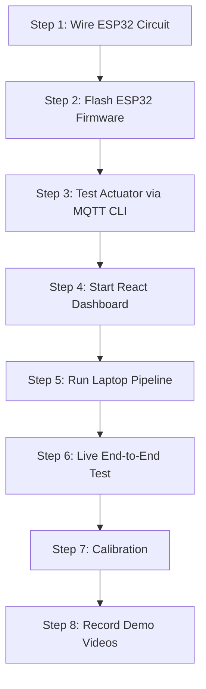

# 🏟️ Intelligent Crowd Flow & Density Safety Oracle — Laptop & Actuator Setup Guide

This guide is designed to prepare you and your team for the laboratory phase and final presentation. It outlines the **Laptop-as-Edge Architecture**, utilizing your laptop's built-in webcam (or pre-recorded video) for edge AI processing, and a wireless ESP32 circuit as the physical gate actuator node.

---

## 💻 Section 1: System Architecture

By using your laptop as the Edge Processing Unit, the system is streamlined, faster, and avoids the networking and installation complexities of a separate microcomputer.

```
+-----------------------------------------------------------------------+
|                            YOUR LAPTOP                                |
|                                                                       |
|   +-----------------------+              +-------------------------+  |
|   |   Python Pipeline     |              |     React Dashboard     |  |
|   |      (main.py)        |              |  (ws://broker.hivemq...) |  |
|   |  (Built-in Webcam or  |              |                         |  |
|   |    Pre-recorded Video)|              |                         |  |
|   +-----------+-----------+              +------------^------------+  |
|               | (Publishes metrics/feed)              | (Subscribes)  |
+---------------|---------------------------------------|---------------+
                |                                       |
                v                                       |
     +--------------------------------------------------+---------------+
     |              Public MQTT Broker (broker.hivemq.com:8000)          |
     +----------------------------------+-------------------------------+
                                        |
                                        | (Subscribes to gate command)
                                        v
                            +-----------------------+
                            |       ESP32 Node      |
                            |  (Servo, LEDs, Buzz)  |
                            +-----------------------+
```

---

## 🛠️ Section 2: Hardware Components Checklist

Ensure you have gathered the following components before starting in the lab:

### **1. Edge Processing & Visualization (Your Laptop)**
- [ ] **Laptop** (With built-in webcam active).
- [ ] **Micro-USB Cable** (To connect the ESP32 to your laptop for power and code uploading).

### **2. Actuator Node (The "Gate")**
- [ ] **ESP32 DevKit v1** (or any standard NodeMCU ESP32 board).
- [ ] **SG90 Micro Servo Motor** (Used to physically rotate the "gate").
- [ ] **Active Buzzer** (3.3V or 5V; sounds automatically when supplied with voltage).
- [ ] **LEDs (3 pieces):**
  - [ ] 1× Green LED (Safe State)
  - [ ] 1× Amber/Yellow LED (Warning State)
  - [ ] 1× Red LED (Critical State)
- [ ] **Resistors:**
  - [ ] 3× $220\Omega$ resistors (To protect the LEDs from burning out).

### **3. Prototyping & Connections**
- [ ] **Solderless Breadboard** (Half-size or full-size).
- [ ] **Jumper Wires:**
  - [ ] ~10× Male-to-Male (M-M) wires.
  - [ ] ~5× Male-to-Female (M-F) wires.
- [ ] **Physical Gate Accessory** (Attach a small piece of cardboard, a stick, or a plastic ruler to the servo horn to visually show the gate opening and closing).

### **4. Wireless Hotspot**
- [ ] **Phone Hotspot (WPA2):** Set up a mobile hotspot on your phone. Your laptop and the ESP32 will both connect to this hotspot to communicate over the public MQTT broker.

---

## 🔬 Section 3: Step-by-Step Laboratory Workflow

Follow this sequence to set up the circuit, compile the firmware, and link it with the edge computer.



### **Step 1: Wire the ESP32 Actuator Circuit (20 mins)**
With the ESP32 unplugged, build the circuit on the breadboard.

> [!WARNING]
> **Check Grounding:** Ensure a common ground wire runs from the ESP32 `GND` pin to the breadboard's negative (-) rail. The grounds of the LEDs, buzzer, and servo must all connect to this same rail.

| Component | Pin Type | ESP32 GPIO Pin | Breadboard Connection |
| :--- | :---: | :---: | :--- |
| **SG90 Servo** | Signal (Yellow/Orange) | **GPIO 13** | Direct connection |
| **SG90 Servo** | Power VCC (Red) | **5V / VIN** | Connects to ESP32 5V pin |
| **SG90 Servo** | Ground (Brown) | **GND** | Connects to Breadboard GND rail |
| **Green LED** | Anode (+) | **GPIO 25** | $\rightarrow 220\Omega$ resistor $\rightarrow$ LED Anode |
| **Amber LED** | Anode (+) | **GPIO 26** | $\rightarrow 220\Omega$ resistor $\rightarrow$ LED Anode |
| **Red LED** | Anode (+) | **GPIO 27** | $\rightarrow 220\Omega$ resistor $\rightarrow$ LED Anode |
| **Active Buzzer** | Positive (+) | **GPIO 14** | Direct connection |
| **Common Rail** | Ground | **GND** | Connects all LED cathodes (-), buzzer negative (-), and servo ground |

---

### **Step 2: Update & Flash ESP32 Firmware (15 mins)**
1. Open the [main.cpp](file:///c:/Users/rohan/OneDrive/Desktop/cursorOP/IOT_EL/backend/esp32-actuator/src/main.cpp) file in your Arduino IDE or PlatformIO.
2. **Modify Credentials & Broker:** Update lines 9, 10, and 13 to use your phone's hotspot and the public HiveMQ broker:
   ```cpp
   const char* ssid     = "YOUR_PHONE_HOTSPOT_SSID";
   const char* password = "YOUR_PHONE_HOTSPOT_PASSWORD";
   const char* mqtt_server = "broker.hivemq.com"; // Connects directly to public broker
   ```
3. Connect the ESP32 to your laptop using the Micro-USB cable.
4. Select the target board (`ESP32 Dev Module`) and COM port, and click **Upload**.
5. **Verify Serial Output:** Open the Serial Monitor at `115200` baud. You should see:
   `[WIFI] Connected successfully!`
   `[MQTT] Connected to broker at broker.hivemq.com... Connected!`
   `[MQTT] Subscribed to topic: oracle/node1/actuation`

---

### **Step 3: Test the Actuator Independently (10 mins)**
Verify the circuit works by sending manual MQTT commands from your laptop. 
Open a terminal, activate your python virtual environment in `backend/rpi-edge`, and publish test states:
*   **Open Gate (Safe):**
    ```bash
    python -c "import paho.mqtt.client as mqtt; c = mqtt.Client(transport='websockets'); c.ws_set_options(path='/mqtt'); c.connect('broker.hivemq.com', 8000); c.publish('oracle_rohan_123/node1/actuation', '{\"command\":\"GATE_OPEN\"}'); c.disconnect()"
    ```
    *Expected:* Green LED turns ON. Servo moves to $0^{\circ}$. Buzzer is silent.
*   **Half-Open Gate (Warning):**
    ```bash
    python -c "import paho.mqtt.client as mqtt; c = mqtt.Client(transport='websockets'); c.ws_set_options(path='/mqtt'); c.connect('broker.hivemq.com', 8000); c.publish('oracle_rohan_123/node1/actuation', '{\"command\":\"GATE_HALF\"}'); c.disconnect()"
    ```
    *Expected:* Amber LED turns ON. Servo moves to $90^{\circ}$. Buzzer is silent.
*   **Closed Gate (Critical):**
    ```bash
    python -c "import paho.mqtt.client as mqtt; c = mqtt.Client(transport='websockets'); c.ws_set_options(path='/mqtt'); c.connect('broker.hivemq.com', 8000); c.publish('oracle_rohan_123/node1/actuation', '{\"command\":\"GATE_CLOSE\"}'); c.disconnect()"
    ```
    *Expected:* Red LED turns ON. Servo moves to $180^{\circ}$. Buzzer sounds loud!

---

### **Step 4: Run the React Dashboard (5 mins)**
1. Open a terminal on your laptop, navigate to the dashboard:
   ```powershell
   cd frontend/dashboard
   ```
2. Start the development server:
   ```powershell
   npm run dev
   ```
3. Open `http://localhost:5173` in your browser. Verify the badge shows **"MQTT Connected"**.

---

### **Step 5: Run the Edge Pipeline (5 mins)**
1. Open a second terminal, navigate to the pipeline:
   ```powershell
   cd backend/rpi-edge
   ```
2. Activate your virtual environment:
   ```powershell
   .\venv\Scripts\activate
   ```
3. Run the pipeline script:
   ```powershell
   python main.py
   ```
   *(To use the built-in webcam, ensure `camera.source` is set to `0` in `config.yaml`. To use the crowd video, verify it is set to `../test/test_videos/crowd2.mp4`).*

---

### **Step 6: Live End-to-End Verification (10 mins)**
1. With both the dashboard and the pipeline running, look at the React Dashboard. Detections, risk score dials, and trend graphs will update live.
2. Look at your ESP32 circuit on the table.
3. Trigger different states (by walking in front of the built-in webcam or playing the crowd video) and watch the physical servo rotate and LEDs light up in real-time.

---

### **Step 7: Calibration & Fine-Tuning (10 mins)**
Adjust settings in `config.yaml` to optimize detection:
*   **Crowd Video:** Set `detection.confidence: 0.15` and `detection.imgsz: 960` for deep-crowd scanning.
*   **Webcam:** If using your laptop webcam in a room, set `detection.confidence: 0.35` and `detection.imgsz: 640` to avoid false positives.

---

### **Step 8: Record Demonstrations (10 mins)**
Record backup videos of your project in action:
*   **Webcam Demo:** Record a video showing your teammates moving in front of the laptop, the dashboard updating, and the physical gate closing.
*   **Pre-recorded Video Demo:** Record the laptop screen showing the crowd video while the physical servo gate actuates next to it on the table.

---

## 🎥 Section 4: Final Presentation Strategy (Using Built-in Webcam)

Since you are using the laptop's built-in webcam, choose one of these two setup options for your demonstration to the evaluators:

### **Setup A: Teammates-in-Background Demonstration**
Use this setup to show live webcam tracking without needing an external screen:

1.  **Placement:** Place the laptop on the table facing the evaluators.
2.  **Presenter:** The presenter stands to the side of the laptop so the screen remains visible and the built-in camera has a clear field of view.
3.  **Teammates (The Crowd):** Teammates stand in the background of the room (behind the evaluators or presenter).
4.  **Action:** Have your teammates group closely together or move rapidly. The built-in webcam will track them, the dashboard will update, and the physical gate circuit sitting on the table will actuate.

---

### **Setup B: Pre-recorded Video Demonstration (Recommended for Tight Spaces)**
Use this setup if the presentation space is too small or crowded to perform a physical simulation:

1.  **Configure for Video:** Run the pipeline using the configured `crowd2.mp4` video.
2.  **Placement:** Place the laptop and your ESP32 breadboard circuit side-by-side on the table facing the evaluators.
3.  **Action:** The evaluators will see the crowd walking on the video inside the dashboard, and see the physical servo gate rotate, LEDs change colors, and the buzzer sound **live on the table** in perfect sync with the video.
4.  **Value:** This demonstrates the full edge-to-actuator IoT loop with 100% reliability and requires zero physical space.
