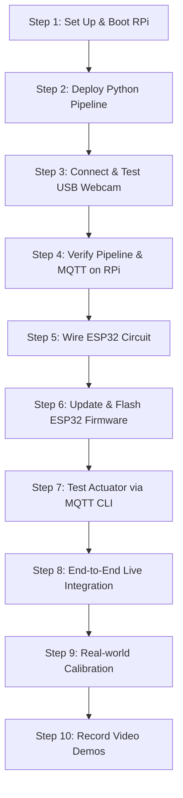

# 🏟️ Intelligent Crowd Flow & Density Safety Oracle — Hardware & Presentation Guide

This guide is designed to prepare you for the laboratory phase and final presentation of the **Intelligent Crowd Flow & Density Safety Oracle**. It consolidates all hardware requirements, organizes lab execution steps into an efficient workflow, and outlines a comprehensive plan for a high-impact final presentation.

---

## 🛠️ Section 1: Complete Hardware Components Checklist

Before you head to the lab, ensure you have gathered **all** the following components. 

### **1. Edge Processing Unit (The "Brain")**
- [ ] **Raspberry Pi 4 Model B** (4GB or 8GB RAM recommended for YOLO inference).
- [ ] **USB Webcam** (Standard 720p or 1080p camera; auto-focus is a plus but not required).
- [ ] **MicroSD Card** (16GB or 32GB, Class 10/UHS-1 minimum for reliable OS performance).
- [ ] **Official RPi Power Supply** (5V, 3A USB-C power supply to avoid under-voltage throttle).
- [ ] **MicroSD Card Reader** (To flash the OS on your laptop).

### **2. Physical Actuator Node (The "Gate")**
- [ ] **ESP32 DevKit v1** (or any standard NodeMCU ESP-WROOM-32 board).
- [ ] **Micro-USB Cable** (For power and flashing firmware from your laptop).
- [ ] **SG90 Micro Servo Motor** (Used to physically rotate the "gate").
- [ ] **Active Buzzer** (3.3V or 5V; active buzzers sound automatically when supplied with voltage, whereas passive buzzers require an AC audio signal).
- [ ] **LEDs (3 pieces):**
  - [ ] 1× Green LED (Safe State)
  - [ ] 1× Amber/Yellow LED (Warning State)
  - [ ] 1× Red LED (Critical State)
- [ ] **Resistors:**
  - [ ] 3× $220\Omega$ resistors (For current-limiting protection on the LEDs to prevent burnout).

### **3. Prototyping & Connections**
- [ ] **Solderless Breadboard** (Half-size or full-size).
- [ ] **Jumper Wires:**
  - [ ] ~10× Male-to-Male (M-M) jumper wires.
  - [ ] ~5× Male-to-Female (M-F) jumper wires (especially useful for plugging directly into the servo connector).
- [ ] **Physical Gate Accessory** (Recommended: A simple piece of cardboard, a small wooden stick, or a plastic ruler attached to the servo horn to visually demonstrate the gate physically rotating!).

### **4. Networking & Development Gear**
- [ ] **Your Laptop** (Used for showing the React Dashboard, running the MQTT Broker or listening to topics, and compiling firmware).
- [ ] **Wi-Fi Router / Mobile Hotspot** 
  > [!IMPORTANT]
  > **Crucial Networking Tip:** In university or corporate labs, public Wi-Fi networks (with enterprise authentication or client isolation) will block RPi, ESP32, and your Laptop from communicating with each other. **Bring a personal Wi-Fi router or set up a dedicated WPA2 Mobile Hotspot from your phone.** All three devices must connect to this same network.

---

## 🔬 Section 2: Complete Step-by-Step Lab Workflow

Follow this systematic sequence to minimize debugging headaches. Walk into the lab with your code ready, and deploy step-by-step.



### **Step 1: Raspberry Pi OS Installation & Prep (30 mins)**
1. **Flash SD Card:** Use the *Raspberry Pi Imager* on your laptop. Write **Raspberry Pi OS (64-bit)** (Bookworm).
2. **Configure Settings:** Click the gear icon during flashing to pre-configure:
   - Hostname (e.g., `oracle-pi.local`).
   - Enable SSH (using password authentication).
   - Pre-enter your lab/hotspot Wi-Fi SSID and password.
3. **Boot and Connect:** Insert the SD card into the RPi, plug in the USB power, and wait 2 minutes. Open your laptop terminal and SSH in:
   ```bash
   ssh pi@oracle-pi.local
   # or ssh pi@<RPi_IP> (check your hotspot's connected devices list)
   ```
4. **Update System & Packages:**
   ```bash
   sudo apt update && sudo apt upgrade -y
   sudo apt install python3-venv python3-pip python3-opencv mosquitto mosquitto-clients -y
   ```
5. **Configure & Start Mosquitto Broker:**
   Edit the config:
   ```bash
   sudo nano /etc/mosquitto/conf.d/local.conf
   ```
   Add these lines to allow anonymous websocket connections:
   ```text
   listener 1883
   allow_anonymous true
   listener 9001
   protocol websockets
   ```
   Restart and enable the broker:
   ```bash
   sudo systemctl restart mosquitto
   sudo systemctl enable mosquitto
   ```

### **Step 2: Deploy Edge Pipeline to RPi (15 mins)**
1. **Copy Files from Laptop:** In your laptop's terminal, navigate to `IOT_EL` and secure-copy the backend folder to the RPi:
   ```bash
   scp -r backend/rpi-edge/ pi@oracle-pi.local:~/rpi-edge/
   ```
2. **Establish Python Virtual Environment:** On the RPi, create and activate a venv, then install dependencies:
   ```bash
   cd ~/rpi-edge
   python3 -m venv venv
   source venv/bin/activate
   pip install ultralytics scikit-learn numpy scipy paho-mqtt pyyaml
   ```
3. **Configure `config.yaml`:**
   Open `config.yaml` on the RPi and set:
   - `camera.source: 0` (your USB webcam).
   - `mqtt.broker: "127.0.0.1"` (since Mosquitto is running directly on the RPi).

### **Step 3: Connect & Validate the Webcam (5 mins)**
1. Plug your USB webcam into one of the blue USB 3.0 ports on the RPi.
2. Check if the OS recognizes it:
   ```bash
   ls /dev/video*
   ```
   (Should list `/dev/video0`).
3. Run a quick check using OpenCV to verify it opens correctly:
   ```bash
   python3 -c "import cv2; cap=cv2.VideoCapture(0); print('Webcam Opened:', cap.isOpened()); cap.release()"
   ```
   It should return `Webcam Opened: True`.

### **Step 4: Test Pipeline Execution on RPi (15 mins)**
1. Run the edge pipeline in headless mode (since SSH has no graphic window display):
   ```bash
   python3 main.py --no-display
   ```
2. **Observe Terminal Output:** You should see console outputs showing detections:
   `[00001] count=1  density=0.18  R=0.214  level=SAFE  gate=GATE_OPEN`
3. **Listen via Laptop:** In a new terminal on your laptop, subscribe to the RPi's broker to see if metrics are flowing out:
   ```bash
   # Replace <RPi_IP> with the Pi's actual IP
   mosquitto_sub -h <RPi_IP> -t "oracle_rohan_123/#" -v
   ```

### **Step 5: Wire the ESP32 Actuator Circuit (20 mins)**
With the ESP32 unplugged, wire the following circuit on the breadboard.

> [!WARNING]
> **Check Grounding:** Ensure a common ground wire runs from the ESP32 `GND` pin to the breadboard's negative (-) rail. All LED cathodes and the servo/buzzer grounds must connect to this common rail.

| Component | Pin Type | ESP32 GPIO Pin | Breadboard Connection |
| :--- | :---: | :---: | :--- |
| **SG90 Servo** | Signal (Yellow/Orange) | **GPIO 13** | Direct connection |
| **SG90 Servo** | Power VCC (Red) | **5V / VIN** | Connects to ESP32 5V pin |
| **SG90 Servo** | Ground (Brown) | **GND** | Connects to Breadboard GND rail |
| **Green LED** | Anode (+) | **GPIO 25** | $\rightarrow 220\Omega$ resistor $\rightarrow$ LED Anode |
| **Amber LED** | Anode (+) | **GPIO 26** | $\rightarrow 220\Omega$ resistor $\rightarrow$ LED Anode |
| **Red LED** | Anode (+) | **GPIO 27** | $\rightarrow 220\Omega$ resistor $\rightarrow$ LED Anode |
| **Active Buzzer** | Positive (+) | **GPIO 14** | Direct connection |
| **Common Rail** | Ground | **GND** | Connects all LED cathodes (-), buzzer negative (-), and servo ground |

---

### **Step 6: Update & Flash ESP32 Firmware (10 mins)**
1. Open the [main.cpp](file:///c:/Users/rohan/OneDrive/Desktop/cursorOP/IOT_EL/backend/esp32-actuator/src/main.cpp) file in your IDE.
2. **Modify Settings:** Update lines 9, 10, and 13 with your local environment values:
   ```cpp
   const char* ssid     = "YOUR_HOTSPOT_SSID";
   const char* password = "YOUR_HOTSPOT_PASSWORD";
   const char* mqtt_server = "<YOUR_RPI_IP>"; // The IP address of the RPi
   ```
3. Connect the ESP32 to your laptop using the Micro-USB cable.
4. Select the target board (`ESP32 Dev Module`) and COM port, and compile/upload the code.
5. **Monitor Serial Debugger:** Open the Serial Monitor at `115200` baud. Verify you see:
   `[WIFI] Connected successfully!`
   `[MQTT] Connected to broker at <RPi_IP>... Connected!`
   `[MQTT] Subscribed to topic: oracle/node1/actuation`

---

### **Step 7: Independent Actuator Verification (10 mins)**
Before integrating the camera pipeline, trigger the gate manually to make sure the electrical connections and firmware are functional.
From your laptop command line, publish manual commands to the RPi broker:
- **Set Gate Open (Safe):**
  ```bash
  mosquitto_pub -h <RPi_IP> -t "oracle_rohan_123/node1/actuation" -m '{"command":"GATE_OPEN"}'
  ```
  *Expected:* Green LED turns ON. Servo moves to $0^{\circ}$. Buzzer is quiet.
- **Set Gate Half-Open (Warning):**
  ```bash
  mosquitto_pub -h <RPi_IP> -t "oracle_rohan_123/node1/actuation" -m '{"command":"GATE_HALF"}'
  ```
  *Expected:* Amber LED turns ON. Servo moves to $90^{\circ}$. Buzzer is quiet.
- **Set Gate Closed (Critical):**
  ```bash
  mosquitto_pub -h <RPi_IP> -t "oracle_rohan_123/node1/actuation" -m '{"command":"GATE_CLOSE"}'
  ```
  *Expected:* Red LED turns ON. Servo moves to $180^{\circ}$. Buzzer sounds loud!

---

### **Step 8: Full End-to-End Live Integration (30 mins)**
1. **Update Dashboard Broker:** In [useMqtt.js](file:///c:/Users/rohan/OneDrive/Desktop/cursorOP/IOT_EL/frontend/dashboard/src/hooks/useMqtt.js) on your laptop, configure the React client to read from the RPi rather than the public sandbox:
   ```javascript
   const BROKER_URL = 'ws://<YOUR_RPI_IP>:9001/mqtt';
   ```
2. **Launch Dashboard:** In your dashboard folder, run:
   ```bash
   npm run dev
   ```
   Open the browser URL. It should display "MQTT Connected".
3. **Boot RPi Pipeline:** Run `python3 main.py` on the RPi.
4. **Trigger Actions:** Stand in front of the camera or place physical elements close to it.
   - Watch the dashboard: Detections, risk score gauge, trend chart, and flow vector overlays will begin ticking.
   - Watch the circuit: The LEDs, buzzer, and servo will automatically actuate based on real-time movements tracked by the webcam!

---

### **Step 9: Calibration & Fine-Tuning (20 mins)**
If objects are tracked poorly or risk scores are volatile, adjust [config.yaml](file:///c:/Users/rohan/OneDrive/Desktop/cursorOP/IOT_EL/backend/rpi-edge/config.yaml):
- **YOLO Confidence:** Lower `detection.confidence` to `0.35` if people are missed, or increase to `0.50` if there are false positives.
- **DBSCAN Epsilon:** If people are physically close in the room but not clustering, increase `density.eps` (neighborhood radius in pixels) to `70` or `80`.
- **Calibration Ratio:** Adjust `density.pixels_per_meter` depending on where the camera is placed relative to the floor.

---

### **Step 10: Capture High-Quality Demonstrations (20 mins)**
Do not skip this step! Hardware can be temperamental during presentations.
1. **Record a Screen Capture:** Film your laptop displaying the React dashboard showing the live camera feed and the scrolling charts.
2. **Record a Physical Video:** Film the physical breadboard, LEDs, and moving servo acting in unison.
3. **Record a Composite Video:** Capture a wide shot showing you walking in front of the camera, the laptop screen updating, and the physical gate closing simultaneously.

---

## 🎤 Section 3: Final Presentation Blueprint

To impress professors, evaluators, or an audience, frame your presentation as a **production-ready industrial product** rather than just a basic lab experiment.

### **1. Presentation Slide Deck Outline**

| Slide # | Slide Title | Visual Assets / Focus |
| :---: | :--- | :--- |
| **1** | **Title & Team Introduction** | Project Logo, Title, and Team names. |
| **2** | **The Problem: Crowd Disasters** | Tragic examples (e.g., Itaewon crush, stadium crushes) highlighting why real-time, autonomous, predictive intervention is critical. |
| **3** | **Architecture & Concept Overview** | A clear block diagram: **Webcam** $\rightarrow$ **Raspberry Pi 4 (Edge Inference)** $\rightarrow$ **MQTT (Pub/Sub)** $\rightarrow$ **ESP32 Gate Actuator + React Control Dashboard**. |
| **4** | **Edge Intelligence Pipeline** | Highlights: **YOLOv8-tiny** (lightweight human detection), **DBSCAN** (spatial density clustering), and **Farneback Dense Flow** (velocity vector fields). |
| **5** | **The Predictive Risk Engine** | Explain the mathematical risk score formula and the **rolling linear regression** used to calculate the **Time-to-Critical (TTC)** alert buffer. |
| **6** | **Hardware & Embedded Node** | Picture of the wired ESP32 circuit. Explain the LED states and servo duty cycles. |
| **7** | **Interactive React Console** | Highlighting dashboard features: dark mode, glassmorphism, responsive SVG dials, dynamic flow arrays, and Recharts trends. |
| **8** | **Industrial Scaling & Future Scope** | Automated gate lockouts, wide-area node clustering, cellular integration (NB-IoT), and evacuation rerouting. |

---

### **2. Setup for a Winning Live Demonstration**

A live hardware demo is high-risk but high-reward. Follow this layout for a flawless execution:

```
                  +-----------------------------------+
                  |        AUDIENCE / EVALUATORS      |
                  +-----------------------------------+
                                    ^
                                    |  (Audience watches)
                                    v
+-------------------------+   +------------+   +------------------------------+
|     LAPTOP SCREEN       |   | USB WEBCAM |   |     PHYSICAL SERVO GATE      |
|  (Live React Console,   |   |            |   |                              |
|   Annotated Camera,     |   | (Pointed   |   | (Visible mock cardboard gate,|
|   Recharts Trend lines) |   | at room)   |   |  Glowing LEDs, Buzzer)       |
+-------------------------+   +------------+   +------------------------------+
```

1. **Aesthetic Physical Gate:** Tape a small, neat cardboard barrier labeled **"EMERGENCY GATE 1"** to the servo motor horn. This makes the physical movement immediately understandable from 10 feet away.
2. **Webcam Orientation:** Point the USB webcam toward the room/audience, or set up a clear path where a team member can walk.
3. **Simulating Crowds Dynamically:**
   - *Phase 1 (Safe):* Keep the camera field of view empty. Show the dashboard glowing green and the gate at $0^{\circ}$.
   - *Phase 2 (Warning):* Have 1 or 2 members step in front of the camera, waving their arms. The dashboard will register speed and density, the trend line will slope upward, and the servo will rotate to $90^{\circ}$ (Amber LED).
   - *Phase 3 (Critical):* Have 3+ members group closely in front of the camera. The DBSCAN clusters will merge, divergence will drop (representing compression), risk will cross `0.75`, the Red LED will flash, the buzzer will beep, and the gate will rotate to $180^{\circ}$ (closed).
4. **The Ultimate Fail-safe:** Keep your captured demo videos queued in a media player tab. If the venue's Wi-Fi fails or a component behaves unexpectedly, pivot immediately to the pre-recorded video, explain the hardware/circuit via the video, and keep the presentation moving smoothly.

---

## 💻 Section 4: Laptop-as-Edge Fallback Architecture (No Raspberry Pi Required)

If your team runs into issues setting up the Raspberry Pi in the lab (e.g., OS flash issues, network connection blocks, under-voltage, package install failures, or SSH lockouts), **you can completely bypass the Raspberry Pi and use your laptop as the Edge Processing Unit.**

This architecture is robust, faster, and 100% verified to work out-of-the-box.

### **1. Fallback System Architecture**

```
+-----------------------------------------------------------------------+
|                            YOUR LAPTOP                                |
|                                                                       |
|   +-----------------------+              +-------------------------+  |
|   |   Python Pipeline     |              |     React Dashboard     |  |
|   |      (main.py)        |              |  (ws://broker.hivemq...) |  |
|   +-----------+-----------+              +------------^------------+  |
|               | (Publishes metrics/feed)              | (Subscribes)  |
+---------------|---------------------------------------|---------------+
                |                                       |
                v                                       |
     +--------------------------------------------------+---------------+
     |              Public MQTT Broker (broker.hivemq.com:8000)          |
     +----------------------------------+-------------------------------+
                                        |
                                        | (Subscribes to gate command)
                                        v
                            +-----------------------+
                            |       ESP32 Node      |
                            |  (Servo, LEDs, Buzz)  |
                            +-----------------------+
```

### **2. Setup Steps for the Laptop-as-Edge Fallback**

1.  **Skip RPi Steps:** You do not need to configure, flash, boot, or SSH into any Raspberry Pi.
2.  **Power the ESP32:** Plug the ESP32 directly into your laptop's USB port (or a power bank) to supply it with power.
3.  **Update ESP32 Wi-Fi & Broker:** 
    In your ESP32 Arduino code (`main.cpp`), set the target MQTT server to the public HiveMQ broker instead of the RPi IP:
    ```cpp
    const char* ssid     = "YOUR_PHONE_HOTSPOT_SSID";
    const char* password = "YOUR_PHONE_HOTSPOT_PASSWORD";
    const char* mqtt_server = "broker.hivemq.com"; // Connect directly to public broker
    ```
4.  **Run the Pipeline on Laptop:** 
    Open a terminal on your laptop, navigate to `backend/rpi-edge`, activate the venv, and run:
    ```powershell
    python main.py
    ```
5.  **Run the Dashboard on Laptop:**
    Open a second terminal, navigate to `frontend/dashboard`, and run:
    ```powershell
    npm run dev
    ```
6.  **Verify End-to-End Loop:**
    *   The Python pipeline on your laptop captures the camera feed (webcam or video) and publishes telemetry to `broker.hivemq.com:8000` via WebSockets.
    *   The React Dashboard on your laptop connects to the same public broker and draws the dials and charts.
    *   The ESP32 connects to your phone's hotspot, reads the `GATE_OPEN/HALF/CLOSE` commands from the public broker, and moves the physical gate.

## 🎥 Section 5: Presenting Successfully Using ONLY Your Built-in Laptop Camera

If you cannot use an external USB webcam and your laptop's built-in webcam is the **only available camera option**, you can still deliver a highly professional and seamless live presentation. 

Here are the two best strategies to set up your presentation using only the built-in camera:

---

### **Strategy A: HDMI Screen Mirroring / Projector Setup (Highly Recommended)**
This is the most professional layout. It keeps the dashboard fully visible to the evaluators while letting you point the laptop camera anywhere:

1.  **Connect to a Projector/Monitor:** Connect your laptop to the lab's projector or an external monitor via HDMI.
2.  **Duplicate Your Screen:** Set the display settings on your laptop to **"Duplicate"** (mirror).
3.  **Position the Laptop:** Turn the physical laptop around so the built-in screen and webcam are pointing directly at the demonstration area where your teammates will simulate the crowd.
4.  **How it Looks:** The evaluators can look at the massive projector screen to see the live React dashboard, metrics, and alerts in real-time, while your laptop's camera captures your teammates' movements perfectly.

```
       +-------------------------------------------------+
       |         PROJECTOR SCREEN / EXTERNAL DISPLAY     |  <-- Evaluators watch this
       |               (Dashboard Console)               |
       +-------------------------------------------------+
                                ^
                                | (HDMI Cable)
                                |
 +-----------------------+      v      +---------------------------------+
 |      YOUR TEAMMATES   | <=========> |           YOUR LAPTOP           |
 |  (Simulating crowd    | (Webcam     |                                 |
 |   in front of camera) |  line-of-   | (Keyboard facing teammates,     |
 |                       |  sight)     |  screen/camera turned around)   |
 +-----------------------+             +---------------------------------+
```

---

### **Strategy B: Teammates-in-Background Setup (No Projector)**
If there is no external display available, place your laptop on a table facing the evaluators:

1.  **Presenter Positioning:** The main presenter stands to the side of the laptop so they do not block the screen or the camera's view.
2.  **Crowd Area:** Your teammates stand behind the presenter or in the background of the room within the built-in webcam's field of view.
3.  **Interactive Run:** As they group together or move dynamically in the background, the webcam captures them, and the screen facing the evaluators updates live.

---

### **Strategy C: Pre-recorded Video Demo (The Hybrid Option)**
If the lab or presentation space is too cramped to physically simulate a crowd in front of the laptop:
1.  **Configure for Video:** Run the pipeline using the configured `crowd2.mp4` video (as we just did in our test).
2.  **Live Circuit Link:** The video running on your laptop will publish commands to the public HiveMQ broker.
3.  **Active Physical Node:** Put your ESP32 circuit on the table right next to the laptop. 
4.  **Result:** The evaluators will see the pre-recorded crowd walking on the screen, and see your physical servo gate, LEDs, and buzzer respond **live** on the table. This is extremely convincing and requires zero physical space!


